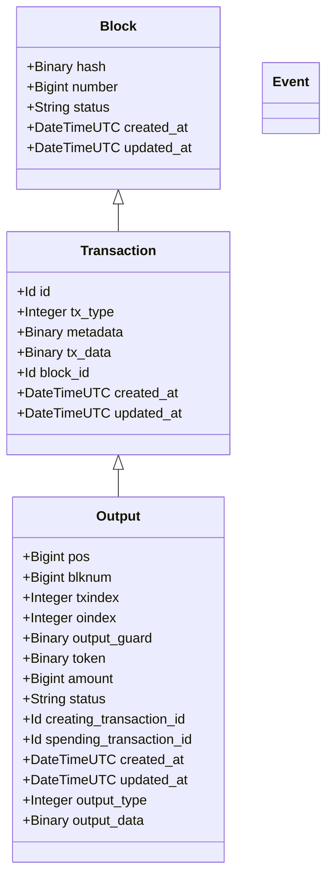

# Overview

The Childchain is the primary service for recording transactions(proxied through a Watcher), and submitting blocks to the plasma contracts. It's broken into a few key applications:

* [**Engine**]()  - Database, States, Business Logic for Transactions.
* [**API**]() - The API layer for the Childchain and primary interaction point for clients.
* [**Status**]() - Monitoring, Metrics, and Operational Awareness for the Childchain.

 

## Engine

#### Schemas

The schema is based on the unraveling of the transaction format.

#### State

The Childchain cares about two running states: what blocks have been recorded, and what actions are occurring on a given output(e.g spending, exiting). 

For **Blocks**, we currently have 3 key states.

| State          | Description                                               |
| -------------- | --------------------------------------------------------- |
| **pending**    | block has been formed and awaiting submission.            |
| **confirming** | block has been submitted successfully. Awaiting finality. |
| **confirmed**  | block has met finality.                                   |

For **Outputs**, we have a few more for the transitional actions that can occur(in progress, finalized):

| **State**        | **Description**                                              |
| ---------------- | ------------------------------------------------------------ |
| **pending**      | output was created. This is the default status and should not change until the block is confirmed. |
| **confirmed**    | the block was confirmed and the output is now also confirmed. |
| **spending**     | The output is being used and formed into the next block.     |
| **spent**        | The output is used and the block confirmed it.               |
| **exiting**      | The output is being marked as exiting. Set from an exit event. |
| **exited**       | The output is confirmed to have been exited by TBD           |
| **piggybacking** | TBD                                                          |
| **piggybacked**  | TBD                                                          |

#### Ethereum Events

The Childchain listens to events being emitted from the plasma contracts. These events let us know what actions the contract has recognize and ensures are states are up-to date to for future user interactions. The process is broken down into two processes, the **listener**, which intercepts the events, and the **callbacks**, which understand how to process the events and update any state that we need to.

#### Listener

TBD

#### Callbacks

##### Deposit

When a deposit event is detected, we create the deposit block, transaction, and output from the event details. The block is **confirmed**, and the output is marked **confirmed**.

##### Standard Exit

When a standard exit event is detected, we mark the output as **exiting**. 

##### Piggyback

TBD

#### Block Submission

##### Form Block

##### Submit Block (Vault Project)

## API

### Versioning

## Status

#### 

##### 
